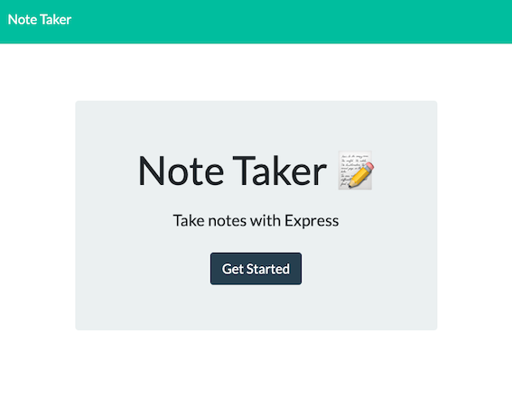
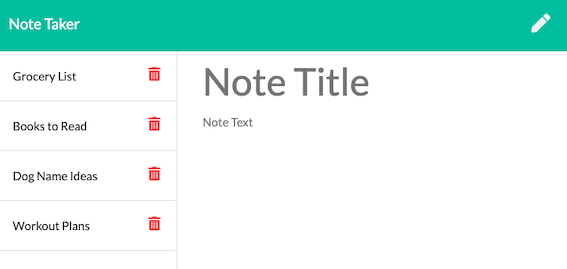

# Express Homework: Note Taker
[Link to Deployed site via Heroku] (https://salty-river-59997.herokuapp.com/
)

[Link to GitHub Repo] (https://github.com/jenniferdaeumler/gt-notetaker-express-homework-11)
## Description
This application allows users to create and save notes, view previously saved notes, and to delete previously saved notes.

## Table of Contents
1. [Installation](#installation)
2. [Usage](#usage)
3. [Credits](#credits)
4. [MIT License](#mit-license)
5. [Contributing](#contributing)

## Installation
Clone the repo, and run in the server.  The deployed app is on Heroku.

## Usage
When you land on the page, click "Get Started" to begin taking notes.  Type your note tile in the placeholder "Note Title".  Type your note in the placeholder "Note Text".  Click the save icon after your note is complete.  To delete a note, click the trashcan icon to the right of the saved note. 

## Credits
Solo projected completed as homework for Georgia Tech Full-Stack Flex Program.
Trilogy Education provided assets. 

## MIT-License
Copyright (c) [2020] [Jennifer Daeumler]

Permission is hereby granted, free of charge, to any person obtaining a copy
of this software and associated documentation files (the "Software"), to deal
in the Software without restriction, including without limitation the rights
to use, copy, modify, merge, publish, distribute, sublicense, and/or sell
copies of the Software, and to permit persons to whom the Software is
furnished to do so, subject to the following conditions:

The above copyright notice and this permission notice shall be included in all
copies or substantial portions of the Software.

THE SOFTWARE IS PROVIDED "AS IS", WITHOUT WARRANTY OF ANY KIND, EXPRESS OR
IMPLIED, INCLUDING BUT NOT LIMITED TO THE WARRANTIES OF MERCHANTABILITY,
FITNESS FOR A PARTICULAR PURPOSE AND NONINFRINGEMENT. IN NO EVENT SHALL THE
AUTHORS OR COPYRIGHT HOLDERS BE LIABLE FOR ANY CLAIM, DAMAGES OR OTHER
LIABILITY, WHETHER IN AN ACTION OF CONTRACT, TORT OR OTHERWISE, ARISING FROM,
OUT OF OR IN CONNECTION WITH THE SOFTWARE OR THE USE OR OTHER DEALINGS IN THE
SOFTWARE.

## Contributing

If you created an application or package and would like other developers to contribute it, you will want to add guidelines for how to do so. The [Contributor Covenant](https://www.contributor-covenant.org/) is an industry standard, but you can always write your own.